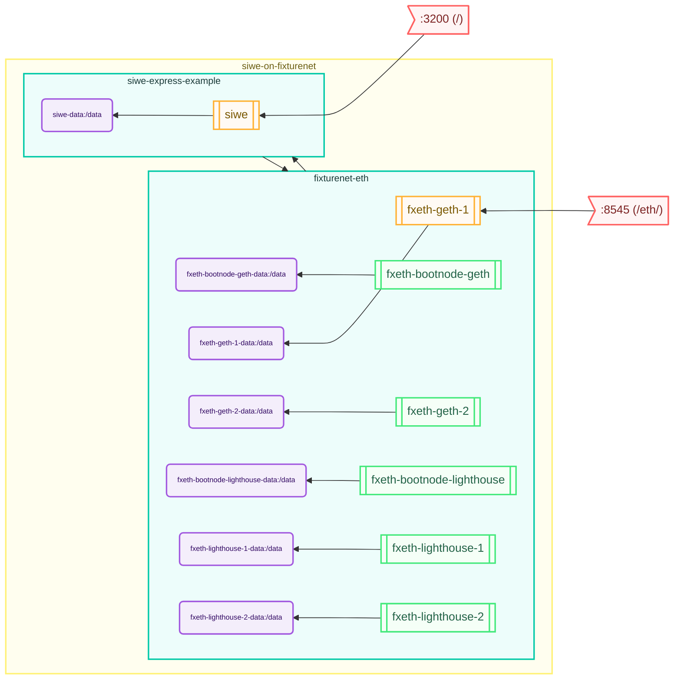

# Sign in with Ethereum Example App

This is a simple example app showing how to use Sign in with Ethereum (SiwE) with Express.  It is closer to a real-world
example than some others, because it includes checks (eg, for inclusion in a smart contract or that the account
has a minimum balance) that real-world apps will likely want to perform.

## Quick Start

This is a `stack`-enabled project, so even though there is quite a bit of behind-the-scenes setup that needs to happen
to exercise it properly (eg, setting up a blockchain, deploying smart contracts, etc.) you can run it very simply with:

```
# Fetch this repo.
$ stack fetch repo bozemanpass/siwe-express-example

# Build/download all the containers.
$ stack prepare --stack siwe-on-fixturenet

# Deploy and run it.
$ stack init --stack siwe-on-fixturenet --output siwe.yml
$ stack deploy --spec-file siwe.yml --deployment-dir ~/siwe
$ stack manage --dir ~/siwe start
```

This will fire up a local blockchain, deploy the smart contract, and start the app.  When using Docker, the HTTP port
will be randomly selected, but you can show it easily by running:

```
$ stack manage --dir ~/siwe port siwe 3200
0.0.0.0:62241
```

## System Diagram
Auto-generated using the `stack chart` command:
<!-- CHART_BEGIN -->

<!-- CHART_END -->
